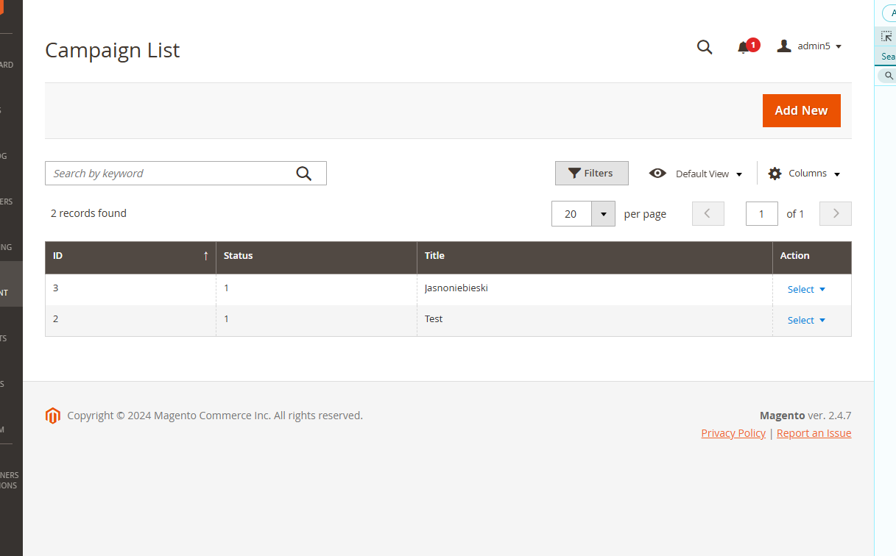

# Impact_Campaign module

**The following example is a complete README for a module Magento_Default:** 

# Impact_Campaign module

The Impact_Campaign module enables you to add the Campaign Labels to existing store. For my personal notes
please ** See personal notes**  at bottom.

Configuration is available on `Content > Impact > Campaign Management`

We can add and configure multiple campaigns - details and #TODO are described in `Personal Notes`

Module enables customized label on product preview in Product Page and Category Listing

Inluced multiple labels

## Installation details

Enable this module with `bin/magento module:enable Impact_Campaign && bin/magento s:up` commands.

## Test

Test is enabled with `vendor/phpunit/phpunit/phpunit -c dev/tests/unit/phpunit.xml.dist app/code/Impact/Campaign/Test/Unit/` command.

### Layouts

The module introduces layout handles in the `view/adminhtml/layout` directory.

Layouts introduced:
    - `campaign_campaign_edit`
    - `campaign_campaign_index`
    - `campaign_campaign_new`

For more information about a layout in Magento 2, see the [Layout documentation](https://devdocs.magento.com/guides/v2.4/frontend-dev-guide/layouts/layout-overview.html).

### UI components

Introduced ui_components
    - `campaign_form`
    - `camapign_listing`

For information about a UI component in Magento 2, see [Overview of UI components](https://devdocs.magento.com/guides/v2.4/ui_comp_guide/bk-ui_comps.html).

### Database

Table `impact_campaign` created with fields:
- `campaign_id`
- `status`
- `title`
- `description`
- `url`
- `products`

For information about a UI component in Magento 2, see [Overview of UI components](https://devdocs.magento.com/guides/v2.4/ui_comp_guide/bk-ui_comps.html).

# ** Personal Notes: ** 
Notes:
    
- I have considered few possibilites to determine if label should be displayed on frontend. We could keep data in
additional table e.g. `campaign_products` or retrieve them from current table. I've decided to add `campaign` Product
Attribute, and update its value with proper Campaign ID - I believe it is best optimized solution
    

- For business logic, multiple campaigns at time should be possible to work. My solutions allow to add them, however
to make it properly working we should add some `sort_order` property to `impact_campaign` table, and during campaign save
`\Impact\Campaign\Service\ProcessCampaignProducts::execute` we should check if product is assigned to other campaign
with "higher" priority and update with new value only these products which **are not** assigned to "highers" campaign.
Other approach would be to display every campaign labels - this is not specified in requirements.
Some `website` configuration could be also considered to specify websites for every configuration
    
- For time saving, I've used some tools for CQRS operations. However typical Repository Pattern could be used aswell
Due of complexity of this task and my free time, I've decided to make it most quick as possible.
Total development, description and work required around 10-12 hours 

